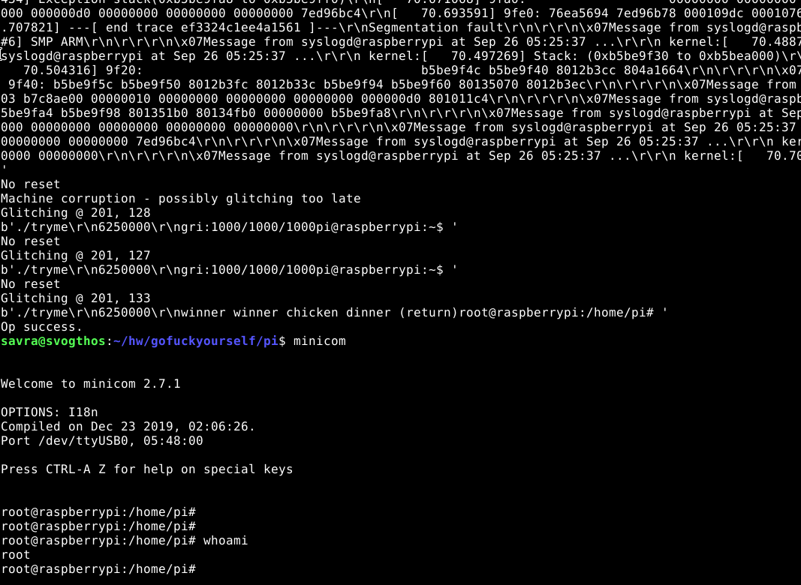

# :w:q

This repository contains my work on fault injection, for a variety of production and test targets.

This repository contains:

- facedancer/* contains code for facedancer-based descriptor length glitching
- chipshouter/* is py3 ported chipshouter
- cwtest/* contains code for chipwhisperer targets
- pi/* contains attacking raspberry pi 3b+

This code is provided as-is. Good luck and godspeed.
