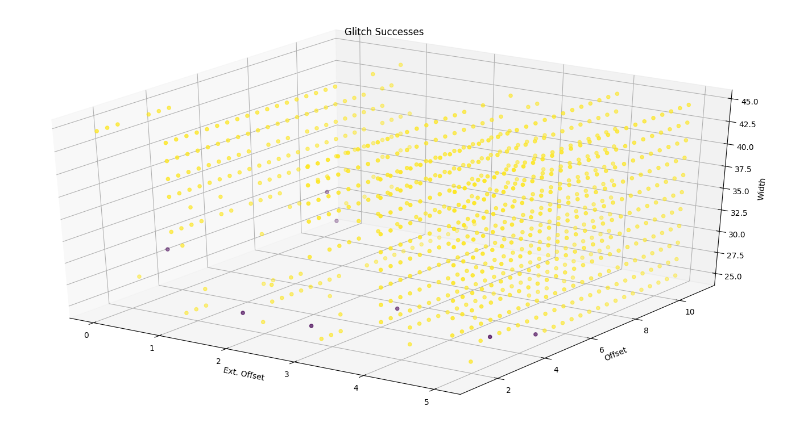

# :w:q

This repository contains some work on glitching, and is intended for use as a template to expose chipwhisperer core functions outside of the gui, so you can stick other scripting scaffolds around them.

This code was written only as a convenience - it is not intended as a replacement to the cw gui, and makes no attempt to expose all functionality.

WIP support for facedancer-based descriptor glitching.
